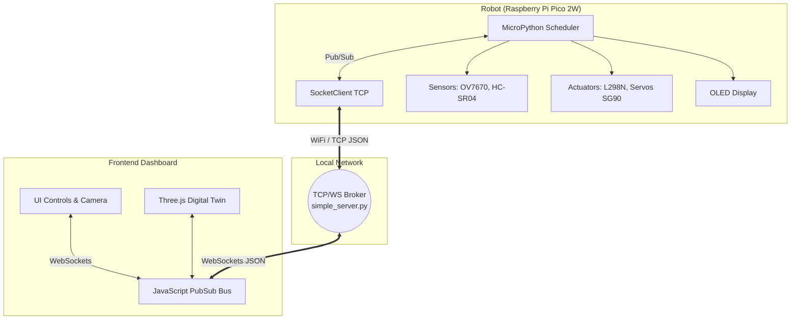

# Autonomous Cardboard Handling Robot

## 1. System Description
This project implements an autonomous robotic system designed to handle cardboard trays. The system utilizes a differential drive chassis for navigation, a MeArm robotic arm for lifting, an OV7670 camera for vision processing (color/ROI detection), and an HC-SR04 ultrasonic sensor for distance measurement.

The core of the system runs on a Raspberry Pi Pico 2W using MicroPython. It features a distributed communication architecture based on the PubSub pattern over a TCP/WebSocket Broker. A web-based frontend provides manual control, real-time camera feed visualization, and a 3D Digital Twin (built with Three.js) to monitor the robot's physical state.

## 2. Architecture Diagram

## 3. Topic Structure (PubSub)
The system uses a centralized Pub/Sub message bus. The default prefix for this robot is `UDFJC/emb1/robot9/`.

### **Published by Robot (Sensors & Telemetry)**
* `sensor/distance`: Publishes HC-SR04 distance readings.
  * *Payload:* `{"distance_cm": float, "status": "ok" | "too_close" | "out_of_range" | "timeout"}`
* `camera/frame`: Publishes the captured frame from the OV7670 camera.
  * *Payload:* `{"w": int, "h": int, "frame": "base64_string"}`
* `camera/colors`: Publishes Region of Interest (ROI) and centroid data for detected colors (Red, Blue, Yellow).
  * *Payload:* `{"red": {...}, "blue": {...}, "yellow": {...}, "frame_w": int, "center_col": int}`
* `debug/watchdog`: Publishes a heartbeat to monitor WiFi stability.
  * *Payload:* `{"msg": "alive"}`

### **Subscribed by Robot (Actuators Control)**
* `car/car_vel`: Receives movement commands for the differential drive system (L298N).
  * *Payload:* `{"action": "up" | "down" | "left" | "right" | "stop"}`
* `arm/joint_state`: Receives movement and kinematic commands for the MeArm.
  * *Payload (Predefined Poses):* `{"action": "extend" | "contract" | "rotate_left" | "rotate_right", "rotation_deg": int}`
  * *Payload (Absolute Angles):* `{"action": "set_angles", "servo1": int, "servo2": int, "servo3": int}`

## 4. Instructions to Run the Project

### **Prerequisites**
1. A Raspberry Pi Pico 2W flashed with the latest MicroPython firmware.
2. A computer connected to the same 2.4GHz WiFi network as the Pico.
3. Python 3.x installed on the computer with the `websockets` library (`pip install websockets`).

### **Step 1: Start the Broker**
1. Open a terminal on your computer and navigate to the folder containing the broker.
2. Run the simple server:
   `python "simple_server a.py"`
3. Note the local IP address of your computer printed in the console (e.g., `192.168.x.x`).

### **Step 2: Configure and Boot the Robot**
1. Open `main.py` (your MicroPython client) in Thonny.
2. Update the network credentials to match your local network:
   `WIFI_SSID = "YOUR_WIFI_NAME"`
   `WIFI_PASS = "YOUR_WIFI_PASSWORD"`
3. Update the `BROKER_IP` variable with your computer's IP address.
4. Save the file to the Raspberry Pi Pico 2W alongside the `ov7670_wrapper.py` and `ssd1306.py` drivers.
5. Provide 5V power to the `VBUS` pin of the Pico. The system will auto-boot, connect to WiFi, and start publishing data.

### **Step 3: Launch the Frontend**
1. Open the `.html` dashboard file in any modern web browser (Chrome/Edge recommended).
2. In the "Conexión WebSocket" panel, input your Broker's IP address.
3. Click **Conectar**. The dashboard will establish a WebSocket connection.
4. You can now use the on-screen buttons or sliders to control the robot, while the 3D Digital Twin syncs with the robot's physical state.
